# Lecture 2.1
### Graphs
- Graphs are fundamental data structures used extensively in computer science and various other fields. They consist of nodes (vertices) and edges connecting these nodes.
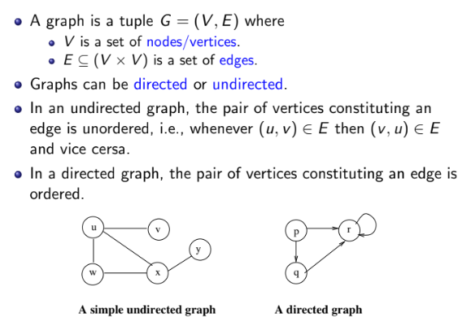
- A graph has two kinds of components one represented by the set v is the set of nodes or vertices those are the circular entities and the other one represented by the set e which is basically a subset of v cross v that is the cartesian product of the set v and v the set of vertices is the set of edges so if you see in this graph on the left there are five vertices u v w x and y.
- Graphs can be finite or infinte. Finite (infinite) graphs have a finite (infinite) number of vertices.
- The degree of a vertex is the number of edges that are connected to it.Edges connected to a vertex are said to be incident on the vertex.

### Final and Initial Nodes
- For many graphs, there are designated special vertices like initial and final vertices.
- These vertices indicate beginning and end of a property that the graph is modeling.
- Typically there is only one initial vertex, but, there could be several final vertices.

### Paths in Graphs
- A path p is a sequence of vertices v1, v2, . . . , vn such that (vi, vi+1) ∈ E for 1 ≤ i ≤ n − 1.
- Length of a path is the number of edges that occur in it. A single vertex path has length 0.
- Sub-path of a path is a sub-sequence of vertices that occur in the path.

### Reachability in graphs
- A vertex v is reachable in a graph G if there is a path from one of the initial vertices of the graph to v.
- An edge e = (u, v) is reachable in a graph G if there is a path from one of the initial vertices to the vertex u and then to v through the edge e.
- A sub-graph G1 of a graph G is reachable if one of the vertices of G1 is reachable from an initial node in G.

---
# Lecture 2.2

### Graph Representations
- **Adjacency Matrix**: A matrix where entry \( A[i][j] \) is 1 if there's an edge from vertex \( i \) to vertex \( j \), otherwise 0. Suitable for dense graphs, takes \( O(V^2) \) space.
  
- **Adjacency List**: An array of lists, where each list \( Adj[u] \) contains vertices adjacent to \( u \). Efficient for sparse graphs, takes \( O(V + E) \) space.

### Breadth-First Search (BFS)
- **Definition**: BFS explores vertices level by level, starting from a given source vertex \( s \).
- **Queue**: Used to manage the order of exploration. Vertices are colored to indicate their state (white for unvisited, blue for in queue, black for processed).
- **Algorithm**:
  1. Start from \( s \), mark it as visited (blue) and enqueue it.
  2. Dequeue a vertex, explore its neighbors, mark them (blue), and enqueue them if not visited.
  3. Continue until the queue is empty.
- **Properties**:
  - Finds shortest paths in an unweighted graph (in terms of number of edges).
  - Visits all reachable vertices from \( s \).

### Analysis
- **Complexity**: \( O(V + E) \), where \( V \) is the number of vertices and \( E \) is the number of edges.
- **Shortest Paths**: BFS constructs a tree of shortest paths from the source vertex \( s \).

### Conclusion
- BFS is fundamental for exploring graphs in a breadth-first manner, useful for shortest path determination and connectivity analysis.
---
# Lecture 2.3

#### Depth First Search (DFS)
- **Overview:**
  - DFS is another fundamental graph traversal algorithm, which, unlike Breadth First Search (BFS), explores as far down a branch as possible before backtracking.
  - Useful for many applications, including finding strongly connected components in directed graphs.

- **Key Characteristics:**
  - DFS starts from a source vertex and explores as deep as possible along each branch before backtracking.
  - Uses a stack data structure, either implicitly through recursion or explicitly.

- **Algorithm Steps:**
  1. **Initialization:**
     - Color all vertices white (unvisited).
     - Set parent (π) of each vertex to NIL.
     - Initialize a timestamp counter to keep track of discovery and finishing times.
  2. **Traversal:**
     - For each vertex \( u \):
       - If \( u \) is white, call DFS-Visit(\( u \)).
  3. **DFS-Visit(\( u \)):**
     - Color \( u \) gray (discovered).
     - Set discovery time \( d[u] \).
     - For each adjacent vertex \( v \) of \( u \):
       - If \( v \) is white, set \( \pi[v] \) to \( u \) and recursively call DFS-Visit(\( v \)).
     - After exploring all adjacent vertices, color \( u \) black (finished).
     - Set finishing time \( f[u] \).

- **Properties:**
  - **Time Complexity:** \( O(V + E) \) where \( V \) is the number of vertices and \( E \) is the number of edges.
  - **Discovery and Finish Times:** Help in understanding the structure of the graph and its connectivity.
  - **Tree Edges:** Edges used in the traversal form a DFS forest.
  - **Back, Forward, and Cross Edges:** Classified based on the discovery and finish times to provide insight into graph structure.

---

#### Strongly Connected Components (SCC)
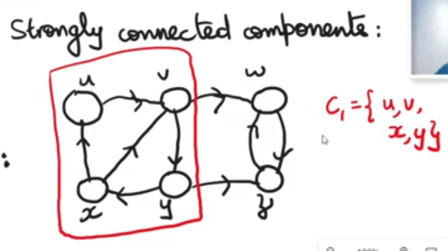
- **Definition:**
  - A strongly connected component of a directed graph is a maximal subgraph where every pair of vertices is mutually reachable.

- **Example:**
  - Consider a directed graph \( G \) with vertices \( u, v, w, x, y, z \). The SCCs are identified as follows:
    - SCC1: \( \{u, v, x, y\} \)
    - SCC2: \( \{w, z\} \)

- **Algorithm to Find SCCs:**
  1. **Run DFS on \( G \) and record the finish times of each vertex.**
  2. **Compute the transpose \( G^T \) of \( G \).**
  3. **Run DFS on \( G^T \), processing vertices in decreasing order of their finish times from the first DFS.**
  4. **Each DFS tree in \( G^T \) represents a strongly connected component in \( G \).**

- **Transpose of a Graph:**
  - The transpose of a graph \( G \) (denoted \( G^T \)) is obtained by reversing the direction of every edge in \( G \).

- **Correctness:**
  - The order of vertices based on finish times ensures that each DFS tree in \( G^T \) corresponds to an SCC in \( G \).

---

#### Key Theorems and Properties
- **Parenthesis Theorem:**
  - Discovery and finish times of DFS form nested intervals resembling parenthesis structure.
  - If two intervals are disjoint, the vertices are in separate subtrees.

- **White Path Theorem:**
  - When DFS is first called on a vertex \( u \), there is a white path from \( u \) to all vertices in the subtree rooted at \( u \).

- **Edge Classification:**
  - **Tree Edges:** Part of the DFS tree.
  - **Back Edges:** Point to an ancestor in the DFS tree.
  - **Forward Edges:** Point to a descendant in the DFS tree.
  - **Cross Edges:** Connect vertices in different DFS trees.

---

#### Applications
- **DFS:**
  - Cycle detection.
  - Path finding.
  - Topological sorting.

- **SCC:**
  - Understanding the structure of directed graphs.
  - Network analysis.
  - Component-based analysis.

---
# Lecture 2.4

coverage criteria that are purely dependent on the structure of graphs, particularly used in software testing contexts. Here's a breakdown of the structural coverage criteria discussed:

1. **Node Coverage**:
   - **Definition**: Ensure every node (or vertex) in the graph is covered by at least one test path.
   - **Test Requirement**: A set of test paths that visit every node at least once.

2. **Edge Coverage**:
   - **Definition**: Ensure every edge in the graph is traversed at least once.
   - **Test Requirement**: A set of test paths that traverse each edge at least once.
- 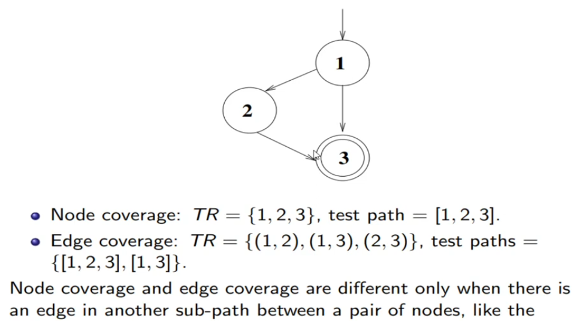

3. **Edge Pair Coverage**:
   - **Definition**: Ensure every pair of edges in the graph is covered.
   - **Test Requirement**: Test paths that cover all pairs of edges up to a length of 2.
   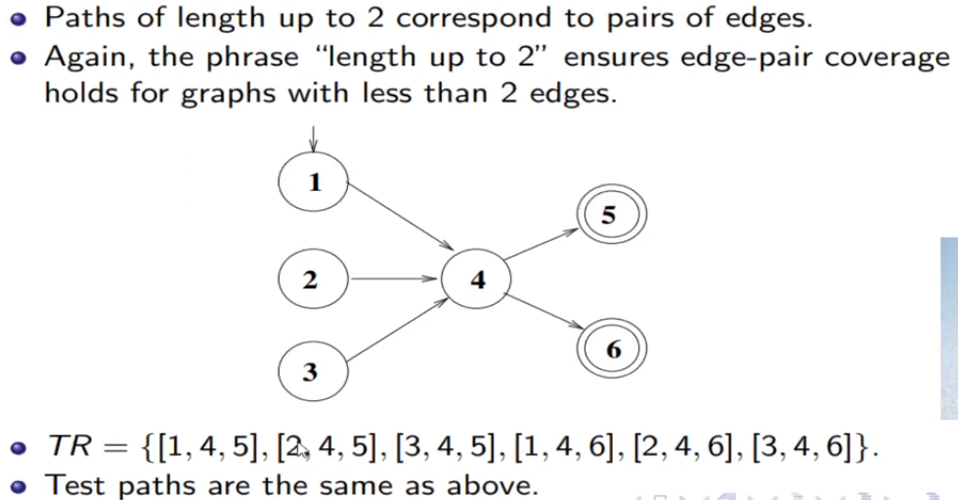

4. **Complete Path Coverage**:
   - **Definition**: Cover all possible paths in the graph.
   - **Feasibility**: Often impractical due to the potentially infinite number of paths, especially in graphs with loops.

---
**Examples**

---

5. **Prime Path Coverage**:
   - **Simple path**: A path is simple if no node appears more than once (no internal loops), except first and last, 
   - **Definition**: Prime paths are maximal simple paths in the graph that do not contain simpler paths within them.
   - **Test Requirement**: Enumerate all prime paths and ensure each is covered by at least one test path. Prime paths are particularly useful for testing loops and conditional structures.
   - Example : 
   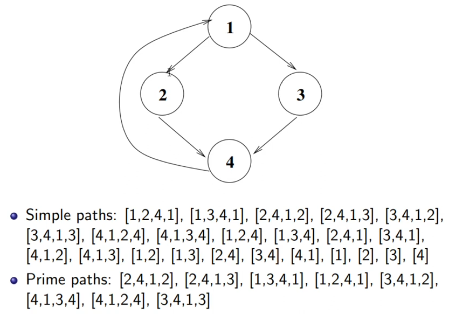

6. **Round Trip Coverage**:
   - **Definition**: Prime paths that start and end at the same node.
   - **Types**: Simple round trip coverage (at least one round trip for each reachable node) and complete round trip coverage (all round trips covered).

7. **Side Trip and Detour**:
   - **Definition**: Techniques to handle infeasibility in complete path coverage by allowing deviations or detours from strict path coverage.
   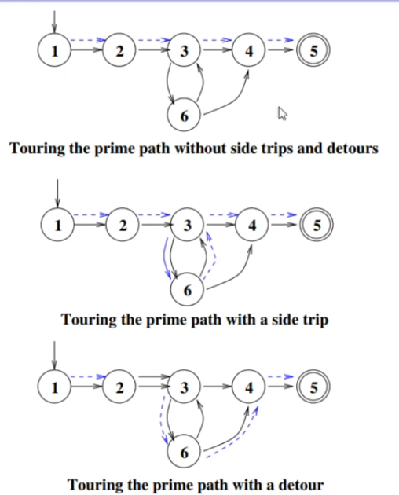

These coverage criteria are essential in graph-based testing methodologies to ensure thorough testing of software artifacts represented as graphs. They help in ensuring that different parts of the software (nodes, edges, paths, loops) are adequately tested, thereby enhancing test coverage and reliability.
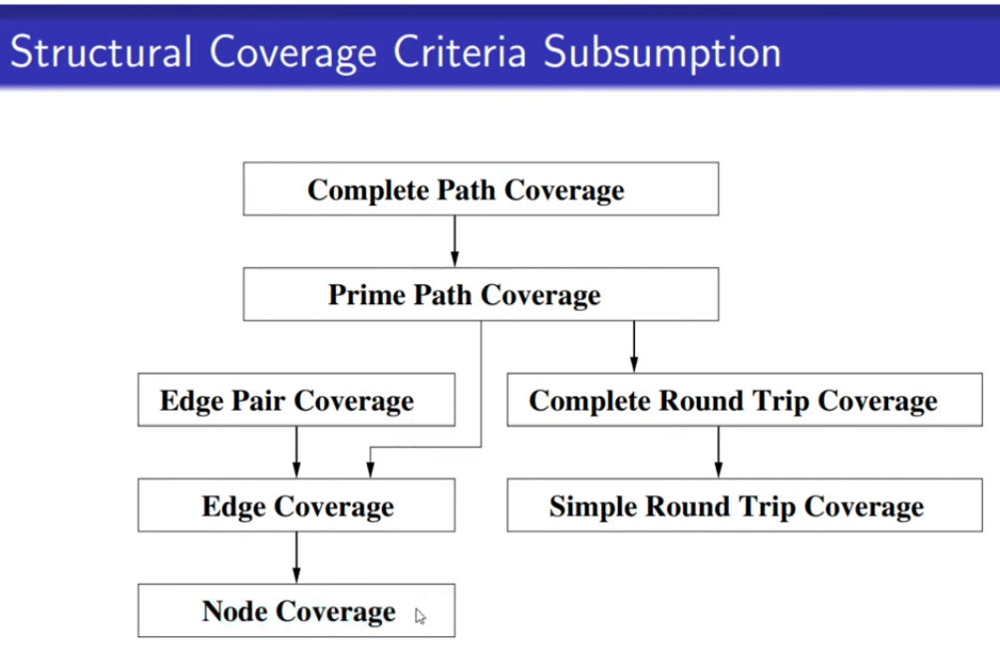

---
# Lecture 2.5

**1. Structural Coverage Criteria:**
   - **Node Coverage:** Test each node (statement) at least once.
   - **Edge Coverage:** Test each edge (branch) at least once.
   - **Edge Pair Coverage:** Test each pair of edges.
   - **Prime Path Coverage:** Test each maximal simple path in the graph, which includes all possible paths skipping or repeating loops.

**2. Algorithms for Test Requirements:**
   - **Node and Edge Coverage:** Directly derived from the graph structure. Use BFS for systematic node and edge traversal.
   - **Edge Pair Coverage:** Enumerate all paths of length 2, ensuring start and end conditions.
   - **Prime Path Coverage:** Enumerate all maximal simple paths systematically.

**3. Algorithm Outline for Prime Path Enumeration:**
   - Start from simple paths of length 0 and incrementally generate paths of increasing length.
   - Mark paths that cannot be extended further (`!`) and simple cycles (`*`).
   - Ensure termination by limiting path length to `|V| - 1`, where `|V|` is the number of vertices.

**4. Prime Path Coverage Test Paths:**
   - **Generating Test Paths:** Start from the longest prime path and extend to include initial and final vertices.
   - Ensure each path starts at an initial vertex and ends at a final vertex.

**5. Practical Application and Tools:**
   - Use of a web application to automate graph input and obtain coverage criteria.
   - Reference to a textbook for detailed algorithms on prime path coverage.

**6. Practical Considerations:**
   - Prime path coverage is effective for testing loops and complex control flows.
   - Balancing between comprehensive coverage and practical test path efficiency.

**7. Limitations and Future Directions:**
   - Optimal test path generation for prime path coverage is NP-hard; heuristic and symbolic execution methods are alternatives.

**8. Conclusion:**
   - Next lecture will focus on practical examples of deriving graphs from code and applying these coverage criteria.

### Additional Notes:
- **Efficiency vs. Completeness:** While a brute-force approach was presented, real-world applications may require more efficient algorithms.
- **Tools and Resources:** Utilize web applications and academic references for practical implementation.

### Example
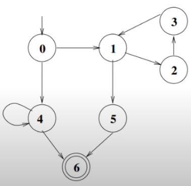
- Simple path as length 0(7 paths)  
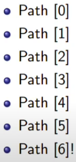
- Simple paths as length 1(9 paths)
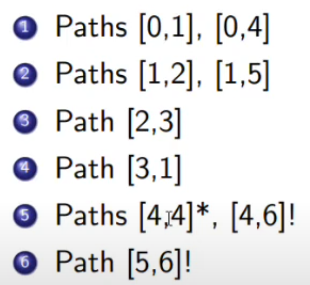
- Simple paths as length 2(8 paths)
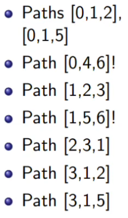
- Simple paths as length 3(7 paths)
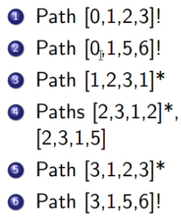
- Simple path as length 4
  - [2,3,1,5,6]!

**There are total 8 prime paths**
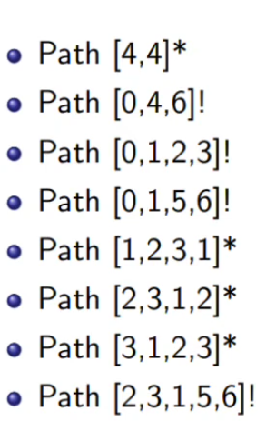